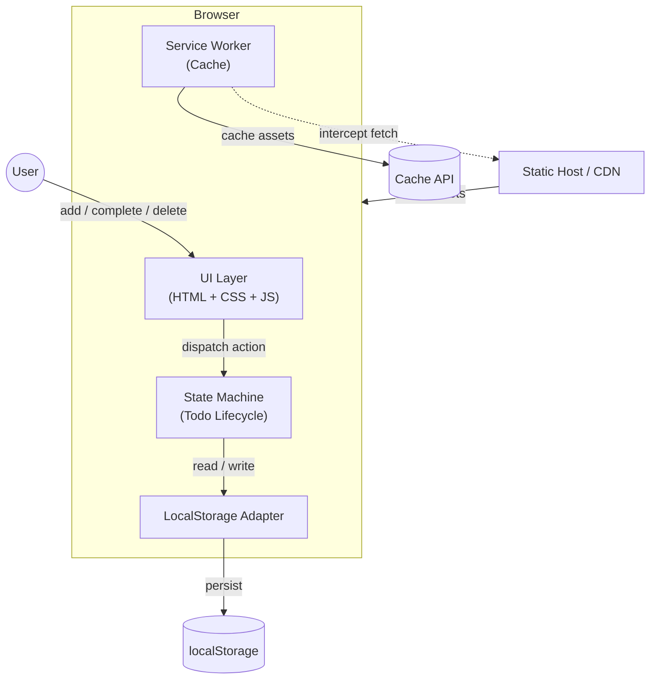
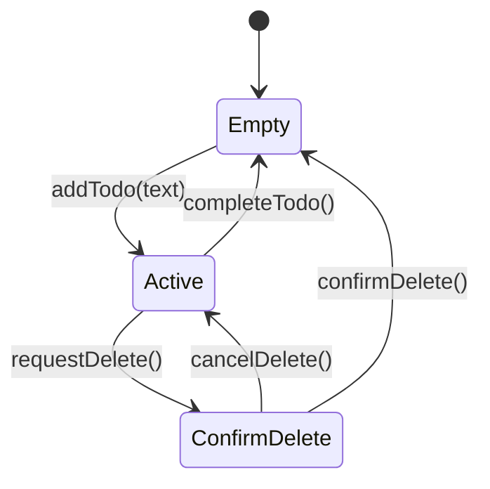
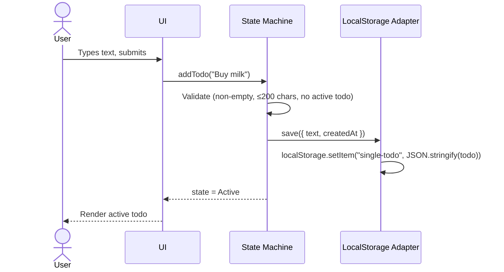
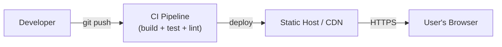

# System Overview — single-todo

## 1. Summary

**single-todo** is a client-side-only web application that holds exactly one todo at a time. There is no backend, no authentication, and no external services in v1. All state lives in the browser's `localStorage`; a service worker makes the app fully offline-capable after the first load.

## 2. High-Level Architecture

## 3. Component Descriptions

| Component | Responsibility | Technology |
|-----------|---------------|------------|
| **UI Layer** | Render current state (empty / active todo), capture user input, enforce character limit, show validation errors. | HTML, CSS, JavaScript (Preact) |
| **State Machine** | Enforce the single-todo constraint. Manage transitions: `empty → active → empty`. Validate inputs. | Plain JS module |
| **LocalStorage Adapter** | Serialize / deserialize the todo to `localStorage`. Provide a thin read/write API so the rest of the app never calls `localStorage` directly. | Plain JS module |
| **Service Worker** | Pre-cache the app shell on install. Serve cached assets on fetch, enabling full offline use after first load. | Workbox or hand-rolled SW |
| **Static Host / CDN** | Serve the built HTML, CSS, JS, and SW files. No server-side logic. | Any static host (e.g., Vercel, Netlify, GitHub Pages, S3+CloudFront) |

## 4. State Flow

- **Empty**: No active todo. Show empty-state illustration and the add-todo input.
- **Active**: Exactly one todo exists. Show todo text, created-at timestamp, complete button, delete button. Hide/disable the add input.
- **ConfirmDelete**: Transient state — a confirmation prompt is visible before the todo is discarded.

## 5. Data Flow (Happy Path — Add Todo)

## 6. Deployment Model

| Concern | Decision |
|---------|----------|
| Hosting | Any static host (zero server-side requirements) |
| HTTPS | Required (service workers need secure origin) |
| CI/CD | Build step produces `index.html`, `app.js`, `sw.js`, CSS. Lighthouse CI gates on perf ≥ 90, a11y ≥ 90. |
| CDN caching | Immutable hashed asset filenames, long `Cache-Control` for JS/CSS. `index.html` gets short TTL or `no-cache`. |

## 7. Key Constraints Recap

| Constraint | Architectural Impact |
|-----------|---------------------|
| C-1: Max one active todo | State machine enforces invariant at the model layer |
| C-2: No auth | No user model, no tokens, no session management |
| C-3: localStorage only | No backend; adapter pattern isolates storage so v2 could swap to IndexedDB or a remote API |
| C-4: Offline after first load | Service worker pre-caches the app shell |
| C-5: WCAG 2.1 AA | Semantic HTML, ARIA labels, visible focus indicators, sufficient contrast |
| C-6: Mobile-first | Responsive CSS with min-width breakpoints; touch-friendly tap targets (≥ 44×44 px) |

## 8. Non-Functional Targets

| Metric | Target | How Enforced |
|--------|--------|-------------|
| JS bundle (gzipped) | < 50 KB | Preact (~4 KB) + minimal deps; CI bundle-size check |
| FCP on 3G | < 2 s | Small bundle, pre-cached assets |
| Lighthouse Perf | ≥ 90 | Lighthouse CI in pipeline |
| Lighthouse A11y | ≥ 90 | Lighthouse CI + axe-core unit tests |
