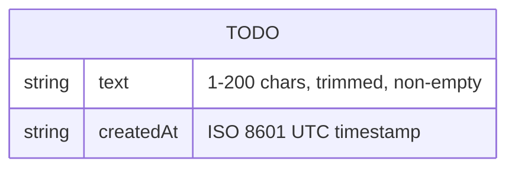
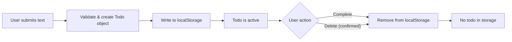
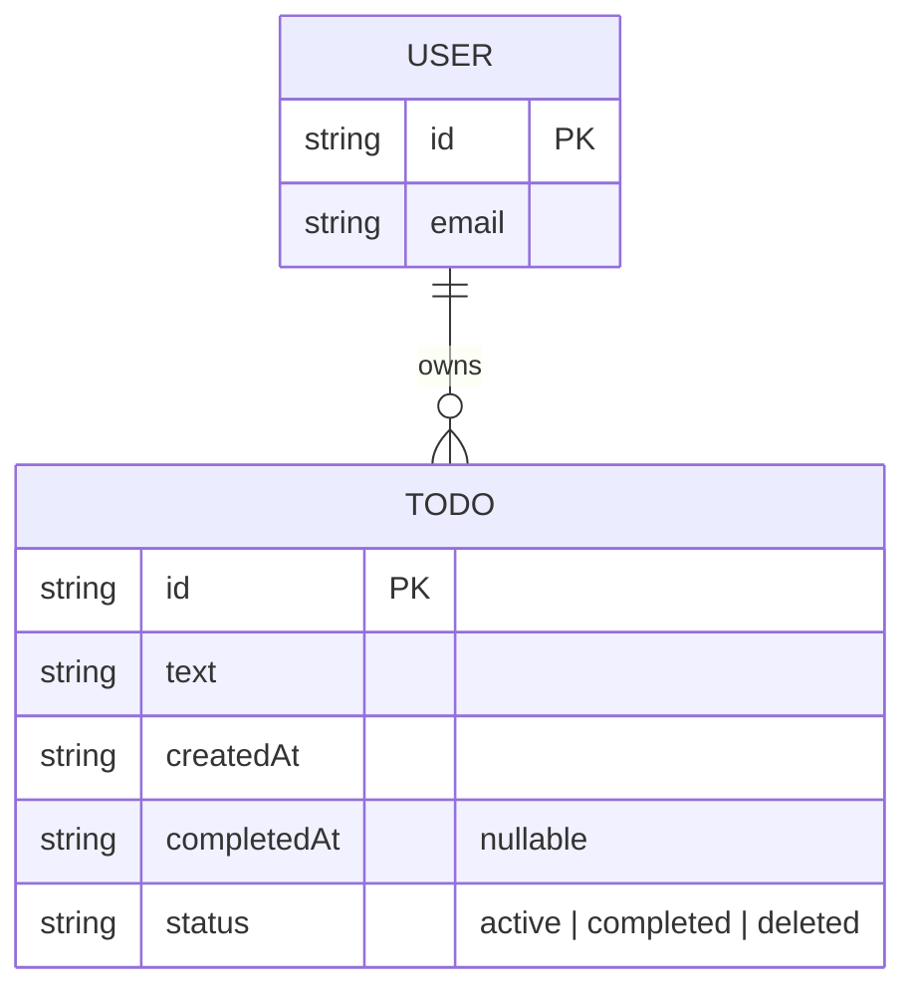

# Data Model — single-todo

## 1. Overview

The data model is intentionally minimal. v1 has a single entity — **Todo** — with at most one instance at any time. There are no relationships, no user entity, and no history.

## 2. Entity–Relationship Diagram



> Because only one entity exists and there are no relationships, the ER diagram is a single box. This is intentional — the simplicity **is** the architecture.

## 3. Entity: Todo

| Field | Type | Constraints | Description |
|-------|------|------------|-------------|
| `text` | `string` | Required. 1–200 characters after trimming. Must not be empty/whitespace-only. | The todo item content entered by the user. |
| `createdAt` | `string` | Required. ISO 8601 format, UTC. | Timestamp recorded at creation time. Displayed as relative time in the UI (e.g., "5 min ago"). |

### Notes

- There is no `id` field. The single-todo constraint means at most one todo exists — identity is implicit.
- There is no `status` or `completed` field. A todo is either present (active) or absent (completed/deleted). "Done = gone."
- There is no `updatedAt` field. Todos cannot be edited in v1.

## 4. Storage Representation

### 4.1 localStorage

The todo is stored under a single key as a JSON string.

| Key | Value |
|-----|-------|
| `single-todo` | `'{"text":"Buy milk","createdAt":"2026-02-27T10:30:00.000Z"}'` |

When no todo exists, the key is removed entirely (`localStorage.removeItem`).

### 4.2 In-Memory (AppState)

The application state wraps the todo in a discriminated union:

```typescript
type AppState =
  | { status: "empty" }
  | { status: "active"; todo: Todo }
  | { status: "confirm-delete"; todo: Todo };
```

`status` is a UI/state-machine concern and is **not** persisted. On app load:

1. Read `localStorage` key `single-todo`.
2. If present and valid JSON → state is `{ status: "active", todo }`.
3. If absent or corrupt → state is `{ status: "empty" }`.

## 5. Validation Rules

| Rule | Enforced At | Error Code |
|------|------------|------------|
| Text is non-empty after trim | State machine (`addTodo`) | `EMPTY_TEXT` |
| Text ≤ 200 characters after trim | State machine (`addTodo`) + UI (input `maxLength`) | `TEXT_TOO_LONG` |
| At most one todo exists | State machine (rejects `addTodo` when state ≠ `empty`) | `TODO_EXISTS` |

## 6. Data Lifecycle



## 7. Future Considerations (v2)

If a backend and history are introduced, the model would expand:



This is speculative and **not** in scope for v1. Documented here so the v1 model is understood as a deliberate subset, not an oversight.
