# User Flows & Screen Inventory — single-todo

---

## 1. Master Flow

```mermaid
flowchart TD
    START((User opens app)) --> LOAD[App loads / SW caches]
    LOAD --> CHECK{localStorage<br/>has todo?}
    CHECK -- "No" --> EMPTY[🖥 Empty State Screen]
    CHECK -- "Yes" --> ACTIVE[🖥 Active Todo Screen]

    EMPTY --> TYPE[User types todo text]
    TYPE --> VALIDATE{Valid input?}
    VALIDATE -- "Empty / whitespace" --> ERROR_EMPTY[Show inline error]
    ERROR_EMPTY --> TYPE
    VALIDATE -- "> 200 chars" --> ERROR_LONG[Show limit error]
    ERROR_LONG --> TYPE
    VALIDATE -- "Valid" --> SUBMIT[User submits]
    SUBMIT --> SAVE[State machine: addTodo]
    SAVE --> PERSIST[Write to localStorage]
    PERSIST --> ACTIVE

    ACTIVE --> COMPLETE_TAP[User taps 'Done']
    COMPLETE_TAP --> REMOVE_COMPLETE[State machine: completeTodo]
    REMOVE_COMPLETE --> CLEAR_LS_1[Remove from localStorage]
    CLEAR_LS_1 --> TOAST_DONE[Toast: 'Done. What's next?']
    TOAST_DONE --> EMPTY

    ACTIVE --> DELETE_TAP[User taps 'Drop it']
    DELETE_TAP --> CONFIRM[🖥 Confirm Delete Screen]
    
    CONFIRM --> YES[User taps 'Yes, drop it']
    YES --> REMOVE_DELETE[State machine: confirmDelete]
    REMOVE_DELETE --> CLEAR_LS_2[Remove from localStorage]
    CLEAR_LS_2 --> TOAST_DROP[Toast: 'Dropped. Fresh start.']
    TOAST_DROP --> EMPTY

    CONFIRM --> NO[User taps 'Keep it']
    NO --> ACTIVE
```



---

## 2. First-Time User Flow

```mermaid
flowchart TD
    VISIT((First visit)) --> DOWNLOAD[Browser downloads assets]
    DOWNLOAD --> SW_INSTALL[Service Worker installs & pre-caches]
    SW_INSTALL --> RENDER[App renders Empty State]
    RENDER --> PROMPT["User sees: 'What needs doing?'"]
    PROMPT --> INPUT[User types their first todo]
    INPUT --> LOCK["User taps 'Lock it in'"]
    LOCK --> ACTIVE["Active Todo displayed with glow entrance animation"]
    ACTIVE --> NEXT["User completes → sees 'Done. What's next?'"]
    NEXT --> LOOP["Empty State returns — cycle continues"]
```



---

## 3. Returning User Flow

```mermaid
flowchart TD
    RETURN((Returning visit)) --> CACHE[SW serves from cache — instant load]
    CACHE --> READ[Read localStorage]
    READ --> HAS{Todo exists?}
    HAS -- "Yes" --> ACTIVE["Resume: Active Todo displayed"]
    HAS -- "No" --> EMPTY["Resume: Empty State"]
```



---

## 4. Offline Flow

```mermaid
flowchart TD
    OFFLINE((User goes offline)) --> CACHED{Assets cached?}
    CACHED -- "Yes" --> WORKS[App works fully — all features operational]
    CACHED -- "No (first visit offline)" --> FAIL[Browser shows default offline page]
    WORKS --> ADD[Add / Complete / Delete — all work via localStorage]
    ADD --> BACK_ONLINE((User goes back online))
    BACK_ONLINE --> SW_UPDATE{New version?}
    SW_UPDATE -- "Yes" --> REFRESH_PROMPT["Prompt: 'New version — refresh'"]
    SW_UPDATE -- "No" --> CONTINUE[Continue as normal]
```



---

## 5. Keyboard-Only Flow

```mermaid
flowchart TD
    TAB_IN((User tabs into app)) --> FOCUS_INPUT[Focus: Input field — visible glow ring]
    FOCUS_INPUT --> TYPE[Type todo text]
    TYPE --> ENTER["Press Enter / Tab to submit button"]
    ENTER --> FOCUS_SUBMIT[Focus: 'Lock it in' button — glow ring]
    FOCUS_SUBMIT --> SUBMIT[Press Enter → todo created]
    SUBMIT --> FOCUS_DONE[Focus: 'Done' button — glow ring]
    FOCUS_DONE --> COMPLETE["Press Enter → completed"]
    COMPLETE --> FOCUS_INPUT_2[Focus returns to input]
    
    FOCUS_DONE --> TAB_DELETE[Tab to 'Drop it' button]
    TAB_DELETE --> PRESS_DELETE[Press Enter → confirm dialog opens]
    PRESS_DELETE --> FOCUS_CONFIRM["Focus: 'Keep it' — glow ring (safe action first)"]
    FOCUS_CONFIRM --> ESC[Press Escape → dialog closes, back to active]
    FOCUS_CONFIRM --> TAB_DROP["Tab to 'Yes, drop it'"]
    TAB_DROP --> CONFIRM_ENTER[Press Enter → deleted]
    CONFIRM_ENTER --> FOCUS_INPUT_3[Focus returns to input]
```



---

## 6. Error Recovery Flow

```mermaid
flowchart TD
    CORRUPT((localStorage corrupted)) --> LOAD[App attempts to read]
    LOAD --> PARSE{JSON parse<br/>succeeds?}
    PARSE -- "No" --> WIPE[Clear localStorage key]
    WIPE --> RECOVERY_TOAST["Toast: 'Something went sideways. Your slate has been cleared.'"]
    RECOVERY_TOAST --> EMPTY[Empty State — fresh start]
    PARSE -- "Yes" --> SCHEMA{Valid schema?<br/>text: string,<br/>createdAt: number}
    SCHEMA -- "No" --> WIPE
    SCHEMA -- "Yes" --> ACTIVE[Active Todo — resume normally]
```



---

## 7. Delight Moments

Micro-moments that elevate the experience from functional to extraordinary:

| Moment | What Happens | Duration | Why It Matters |
|--------|-------------|----------|----------------|
| **First load** | Orb fades in from nothing, starts floating | 600ms | The app feels alive from the first frame |
| **Todo locked in** | Card springs up with glow pulse, toast slides up | 400ms card + 300ms toast | Commitment feels weighty and real |
| **Completion** | Card flashes green glow, scales down and fades, toast celebrates | 300ms card + 300ms toast | Achievement is recognized, not just processed |
| **Deletion confirmed** | Dialog dissolves, card fades, toast acknowledges | 200ms dialog + 300ms card | Letting go is gentle, not violent |
| **Character limit approach** | Counter color shifts amber at ≤20 | Instant | The interface breathes with the user |
| **Focus ring** | Neon cyan glow ring with 120px outer halo | 200ms transition | Every focused element feels electric |

---

## 8. Screen Inventory

| # | Screen | State | Key Elements | File |
|---|--------|-------|-------------|------|
| S-1 | **Empty State** | `status: "empty"` | Logo, headline, supporting text, input field, submit button, character counter, empty-state visual | `docs/design/screens/empty-state.md` |
| S-2 | **Active Todo** | `status: "active"` | Logo, embossed label, todo text, timestamp, complete button, delete button | `docs/design/screens/active-todo.md` |
| S-3 | **Confirm Delete** | `status: "confirm-delete"` | Overlay on S-2, dialog card, headline, supporting text, confirm button, cancel button | `docs/design/screens/confirm-delete.md` |

### Transient States (Not Full Screens)

| # | State | Trigger | Duration | Visual |
|---|-------|---------|----------|--------|
| T-1 | **Validation Error** | Empty/long input submitted | Until corrected | Input glow changes to danger red, shake animation |
| T-2 | **Completion Toast** | Todo completed | 3 seconds | Toast slides up from bottom — "Done. What's next?" |
| T-3 | **Deletion Toast** | Todo deleted (confirmed) | 3 seconds | Toast slides up — "Dropped. Fresh start." |
| T-4 | **Creation Toast** | Todo added | 3 seconds | Toast slides up — "Locked in. Focus on this." |

---

## 9. Screen Transitions

```mermaid
stateDiagram-v2
    [*] --> EmptyState : App loads (no todo)
    [*] --> ActiveTodo : App loads (has todo)
    
    EmptyState --> ActiveTodo : addTodo() ✓
    EmptyState --> EmptyState : addTodo() ✗ (validation)
    
    ActiveTodo --> EmptyState : completeTodo()
    ActiveTodo --> ConfirmDelete : requestDelete()
    
    ConfirmDelete --> EmptyState : confirmDelete()
    ConfirmDelete --> ActiveTodo : cancelDelete()
```



### Animation Choreography

| Transition | Animation | Duration | Easing |
|-----------|-----------|----------|--------|
| Empty → Active | Todo card scales up from 0.95 + fades in + glow pulses once | 400ms | `cubic-bezier(0.34, 1.56, 0.64, 1)` |
| Active → Empty | Todo card scales down to 0.95 + fades out, then input fades in | 300ms out + 200ms in | `ease-out` + `ease-in` |
| Active → Confirm | Backdrop fades in (200ms) + dialog slides up (300ms) | 300ms | `cubic-bezier(0.34, 1.56, 0.64, 1)` |
| Confirm → Active | Dialog slides down + backdrop fades out | 200ms | `ease-in` |
| Confirm → Empty | Dialog + backdrop fade out (200ms), then Active → Empty plays | 200ms + 300ms | `ease-in` + `ease-out` |

### Choreography Stagger Rules

When multiple elements animate simultaneously, they stagger to create a natural flow:

```
Element 1: 0ms    ─────────▶  (leads)
Element 2: 50ms      ─────────▶  (follows)
Element 3: 100ms        ─────────▶  (trails)
```

- **Toast after card exit:** Toast waits for card exit to reach 50% completion before entering.
- **Input after card exit:** Input fades in after card exit completes fully.
- **Dialog after backdrop:** Dialog entry starts 50ms after backdrop entry begins.

---

## 10. Component Inventory

| # | Component | Used In | File |
|---|-----------|---------|------|
| C-1 | **AppShell** | All screens | `docs/design/components/app-shell.md` |
| C-2 | **Logo** | All screens | `docs/design/components/logo.md` |
| C-3 | **TodoInput** | S-1 (Empty State) | `docs/design/components/todo-input.md` |
| C-4 | **TodoCard** | S-2 (Active Todo), S-3 (Confirm Delete bg) | `docs/design/components/todo-card.md` |
| C-5 | **ActionButton** | S-1, S-2, S-3 | `docs/design/components/action-button.md` |
| C-6 | **ConfirmDialog** | S-3 (Confirm Delete) | `docs/design/components/confirm-dialog.md` |
| C-7 | **Toast** | Transient states T-2, T-3, T-4 | `docs/design/components/toast.md` |
| C-8 | **EmptyVisual** | S-1 (Empty State) | `docs/design/components/empty-visual.md` |
| C-9 | **CharCounter** | S-1 (inside TodoInput) | `docs/design/components/char-counter.md` |

---

## Handoff

| Artifact | Path | Status |
|----------|------|--------|
| User Flows & Screen Inventory (this file) | `docs/design/00-user-flows.md` | ✅ Complete |

### Notes for Engineer

- All Mermaid diagrams render in GitHub Markdown natively.
- Screen inventory maps 1:1 to screen design docs in `docs/design/screens/`.
- Component inventory maps 1:1 to component docs in `docs/design/components/`.
- Animation durations and easings are exact specs — implement as written.
- Focus management flow (Section 5) is critical for REQ-009 (Keyboard Accessibility).
- Error recovery flow (Section 6) corresponds to the corrupt-data handling in `storageAdapter.ts`.
- Delight moments (Section 7) are the soul of the UX — do not skip them.
